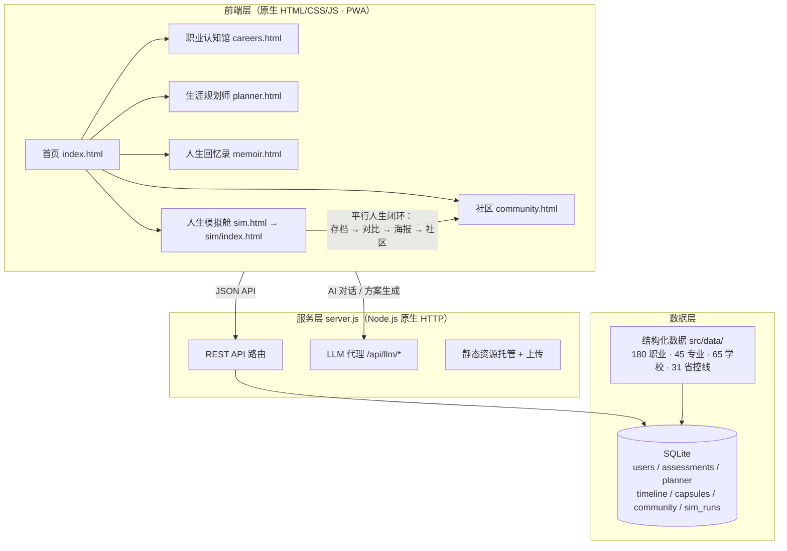
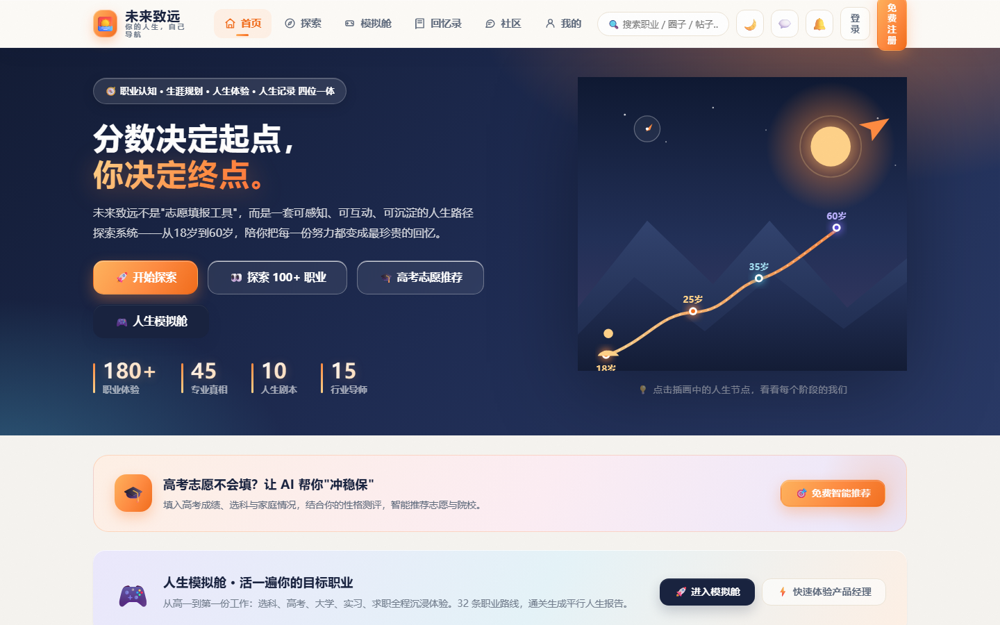
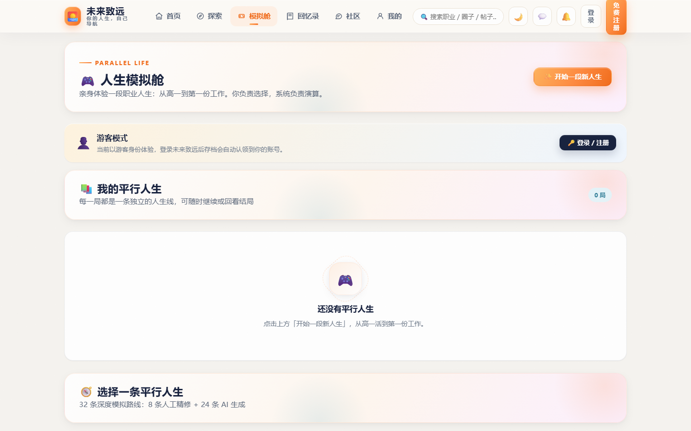
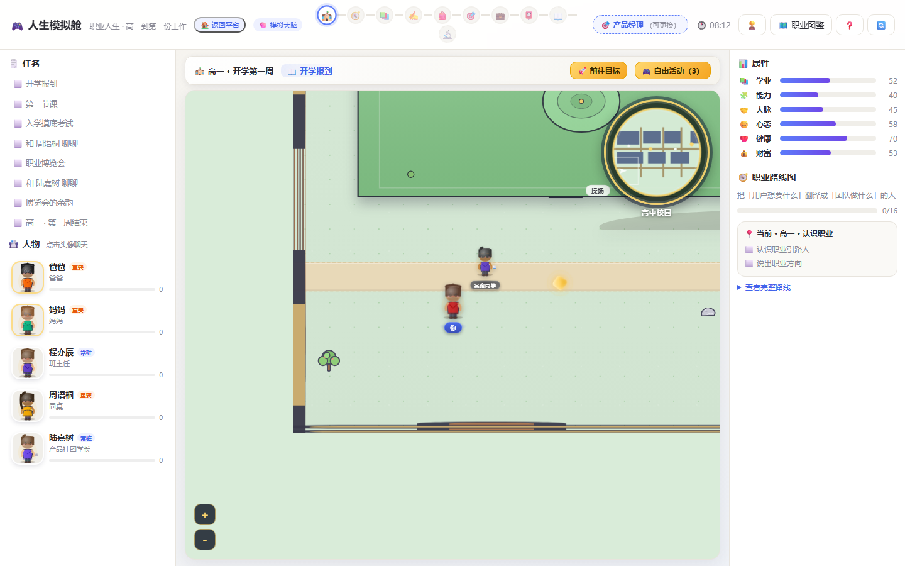
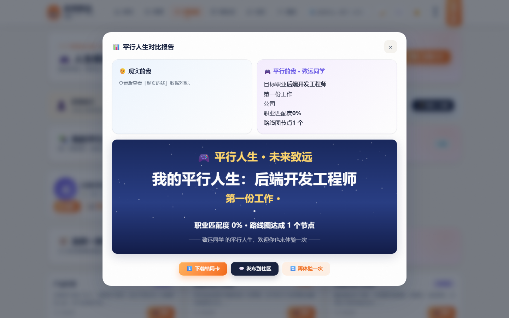

<div align="center">

# 🚀 未来致远 · 你的人生，自己导航

> 职业认知启蒙 · 生涯规划伴侣 · 人生动力记录 · 人生模拟舱 —— 四位一体成长平台
>
> 从「认识职业」到「模拟人生」，用一场平行人生，为现实中的每一个选择提供参考。

[](https://developer.mozilla.org/zh-CN/docs/Web/JavaScript)
[](https://nodejs.org/)
[](https://www.sqlite.org/)
[](package.json)
[](public/manifest.json)
[](e2e/)
[](package.json)
[](LICENSE)

**零外部依赖 · 开箱即用 · 数据本地化 · 可离线部署**

</div>

## 📖 目录

- [项目简介](#-项目简介)
- [功能特性](#-功能特性)
- [系统架构](#-系统架构)
- [快速开始](#-快速开始)
- [项目结构](#-项目结构)
- [API 概览](#-api-概览)
- [实测结果](#-实测结果)
- [更新日志](#-更新日志)
- [许可证](#-许可证)

## 💡 项目简介

「未来致远」是一个 **零外部依赖** 的人生成长平台：后端使用 Node.js 原生 HTTP 服务 + SQLite 存储，前端为原生 HTML / CSS / JavaScript（含手写 SVG 图表库），**无需 `npm install` 即可运行**。

平台将 **《我的模拟人生路》** 的人生模拟舱完整融合进主站：在这里你可以了解 180 个职业的真实画像、完成兴趣测评获得专属生涯规划、记录人生里程碑、开启一场属于你的平行人生，并把模拟人生的结局沉淀为可分享的对比报告与海报。

## ✨ 功能特性

| 模块 | 说明 |
| ---- | ---- |
| 🧭 职业认知馆 | 180 个职业 / 45 个专业 / 65 所院校 / 31 省控线，职业画像 + 四维雷达图 + 发展路径 |
| 🎯 生涯规划师 | 兴趣测评 + AI 生成专属规划方案，目标拆解、里程碑、时间胶囊 |
| 📖 人生回忆录 | 时间线记录、成长纪念册、心情签到，把每一天都变成可回望的足迹 |
| 🎮 人生模拟舱 | 32 条职业路线（8 精修 + 24 AI 模板），沉浸式文本冒险 + 角色人设 + Canvas 动态场景 |
| 🔁 平行人生闭环 | 模拟存档 → 人生对比报告 → 海报分享 → 社区发布，形成完整闭环 |
| 🤖 AI 能力 | 内置 LLM 代理（可配置），支持 AI 对话、方案生成与模拟剧情扩展 |
| 📱 PWA | 支持安装到桌面、离线打开，移动端自适应 |

## 🏗️ 系统架构



## 🚀 快速开始

> 需要 [Node.js](https://nodejs.org/) ≥ 22.5，**无需安装任何 npm 依赖**。

```bash
# 1. 克隆仓库
git clone https://github.com/Tazz-zhu/weilai-zhiyuan.git
cd weilai-zhiyuan

# 2. 启动服务（首次运行自动建库、自动导入数据）
node server.js

# 3. 打开浏览器
# http://localhost:4173
```

**演示账号**

| 账号 | 密码 | 说明 |
| ---- | ---- | ---- |
| `demo` | `demo123` | 预置测评数据、会员权益与徽章 |
| `xinqing` | `xinqing123` | 心情 / 回忆录演示数据 |

**人生模拟舱入口**：首页 → 人生模拟舱（`/sim.html`），游客模式也可直接开玩，登录后自动认领存档。

## 📦 项目结构

```
weilai-zhiyuan/
├── server.js                 # 服务入口：REST API + 静态托管 + LLM 代理
├── package.json              # 零运行时依赖，Node >= 22.5
├── src/
│   ├── db.js                 # SQLite 数据层：建表 / CRUD / 游客存档认领
│   ├── engine.js             # 职业评分引擎 + 徽章系统
│   ├── seed.js               # 演示账号与种子数据
│   └── data/                 # 180 职业 / 45 专业 / 65 学校 / 31 省控线
├── public/
│   ├── index.html            # 首页
│   ├── sim.html              # 人生模拟舱启动器（存档 / 对比 / 海报 / 社区）
│   ├── sim/                  # 人生模拟游戏（融合自《我的模拟人生路》）
│   ├── js/                   # 业务模块，含零依赖 SVG 图表库 charts.js
│   ├── css/  icons/  share/  share-cards/
│   └── manifest.json         # PWA 清单
├── docs/
│   └── screenshots/          # 项目截图
├── e2e/                      # 端到端测试（Playwright）
├── CHANGELOG.md              # 完整迭代历史（V1 - V26）
└── LICENSE                   # MIT 许可证
```

## 📡 API 概览

| 分组 | 端点 |
| ---- | ---- |
| 统一数据源 | `GET /api/library`（职业 / 专业 / 学校 / 省控线） |
| 职业认知 | `GET /api/careers`、`GET /api/careers/:id`、`GET /api/careers/:id/path` |
| 账号 | `POST /api/auth/register`、`POST /api/auth/login`、`GET /api/me` |
| 测评规划 | `POST /api/assessments`、`GET /api/planner` |
| 人生记录 | `GET\|POST /api/timeline`、`GET\|POST /api/capsules` |
| 社区 | `GET\|POST /api/community`、`POST /api/community/:id/comments` |
| AI | `POST /api/llm/chat`、`GET\|POST /api/llm/config` |
| 模拟舱 | `GET\|POST /api/sim/runs`、`PUT\|DELETE /api/sim/runs/:id`、`POST /api/sim/claim` |

## 🧪 实测结果

| 测试 | 结果 |
| ---- | ---- |
| 平台端到端 `e2e/smoke.mjs` | ✅ 102 / 102 通过 |
| 人生模拟舱端到端 `e2e/sim-smoke.mjs` | ✅ 20 / 20 通过，0 JS 错误 |
| 模拟引擎逻辑 `e2e/sim-logic.cjs` | ✅ 6 条路线全流程跑到 Offer |

<div align="center">







</div>

## 📜 更新日志

完整迭代历史（V1 → V26，含《我的模拟人生路》融合全过程）见 [CHANGELOG.md](CHANGELOG.md)。

## 📄 许可证

[MIT](LICENSE) © 2026 [Tazz-zhu](https://github.com/Tazz-zhu)